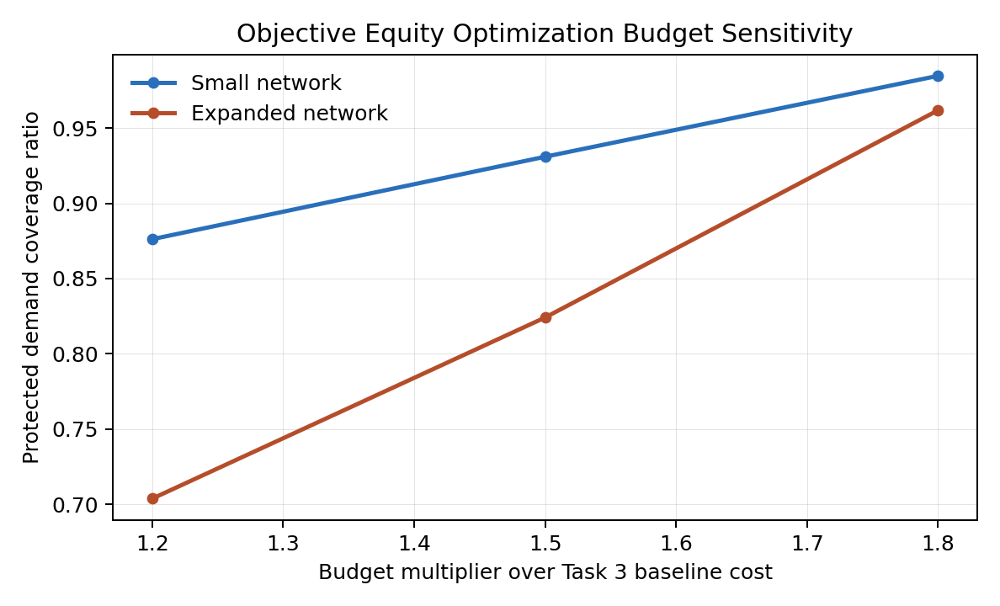
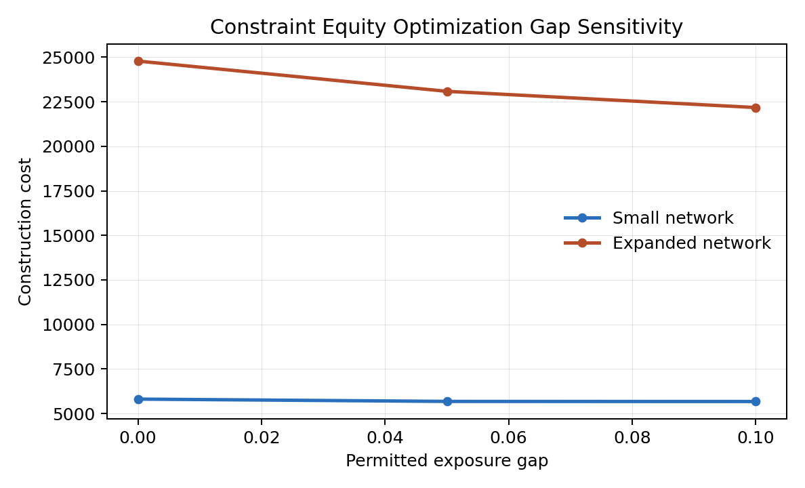

# Equity Extension for the MnDOT Bicycle-Lane Network Design Software

This repository contains an equity-focused extension of the **MnDOT Bicycle-Lane Network Design Software**. It implements two equity-aware network design models and evaluates them on small and expanded transportation networks. Each model enforces an 80% total-demand coverage target while accounting for differences between protected and unprotected demand.

## Relationship to the MnDOT Software

The extension reuses the MnDOT software's network parsing, OD processing, candidate-path generation, design-unit construction, and baseline service calculations. It adds protected-demand inputs, two equity formulations, targeted equity-scenario generation, equity-specific result metrics, and sensitivity analysis. The files in this repository therefore represent the equity-analysis component of the broader MnDOT bicycle-lane network design workflow.

## Models

### Objective I-E: Protected Exposure Minimization

Objective I-E minimizes the uncovered-exposure burden of protected demand subject to a construction budget and the service requirement. The budget is defined as

```text
B = budget_gamma * C_80/80
```

where `C_80/80` is the retained baseline construction cost. Small-network instances are solved with an exact Gurobi model; expanded-network instances use a budget-constrained ALNS heuristic.

### Constraint II-D: Exposure Disparity Constraint

Constraint II-D minimizes construction cost while limiting the difference between protected and unprotected uncovered-exposure burdens:

```text
E_protected - E_unprotected <= eta_exposure
```

Small-network instances use a Gurobi mixed-integer model. Expanded-network instances use a constraint-repair ALNS heuristic.

## Repository Structure

```text
.
|-- run_all_models_both_p.py
|-- visualize_optimization_results.py
|-- baseline_inputs/
|-- objective_I_E_refine/
|   |-- data/
|   |-- legacy_src/
|   |-- generate_targeted_pi_from_base.py
|   |-- run_objective_I_E_refine.py
|   `-- solve_objective_I_E_refine.py
|-- constraint_II_D_exposure_disparity/
|   |-- data/
|   |-- legacy_src/
|   |-- generate_targeted_pi_from_base.py
|   |-- run_constraint_II_D.py
|   `-- solve_constraint_II_D.py
|-- combined_model_runs/20260726_204835/
`-- report_results/
    |-- tables/
    |-- figures/
    `-- sensitivity_analysis/
        |-- tables/
        `-- figures/
```

The modules in each `legacy_src/` directory provide the TNTP readers, OD sampling, candidate path generation, design-unit construction, and baseline service calculations used by the current solvers.

## Requirements

- Python 3
- Gurobi with a valid license
- NetworkX
- Pandas
- Matplotlib

The expanded-network runs are computationally intensive. The retained experiments use a 10-hour limit for each small and expanded solve and up to 1,000,000 ALNS iterations.

## Prepare the Targeted Equity Scenario

The targeted scenario assigns higher protected shares to OD pairs that were uncovered by the baseline design. Regenerate the model-specific input files with:

```bash
python3 objective_I_E_refine/generate_targeted_pi_from_base.py
python3 constraint_II_D_exposure_disparity/generate_targeted_pi_from_base.py
```

The generators use the two retained inputs in `baseline_inputs/`. The resulting protected demand shares on baseline-uncovered OD pairs are approximately 58.60% for the small network and 58.61% for the expanded network.

## Run the Main Experiments

Run both models, both protected-share scenarios, and both network sizes with:

```bash
python3 run_all_models_both_p.py \
  --time-limit-hours 10 \
  --large-iterations 1000000 \
  --large-workers 4 \
  --threads 4 \
  --coverage-share 0.8 \
  --epsilon 0.2 \
  --t 0.2 \
  --budget-gamma 1.5 \
  --eta-exposure 0.05
```

Use `--model`, `--p-mode`, and `--run-id` to restrict a run or select its output directory. The two model directories also contain focused usage notes for running a single formulation.

## Retained Results

The main experiment results are available in:

- `report_results/tables/extracted_10h_results.csv`
- `report_results/tables/extracted_10h_results.json`
- `combined_model_runs/20260726_204835/`

The six network deployment figures are stored in `report_results/figures/` for the baseline, Objective I-E, and Constraint II-D solutions on both network sizes.

## Sensitivity Analysis

The sensitivity analysis uses the targeted equity scenario and the full OD sets: 177 OD pairs for the small network and 711 OD pairs for the expanded network.

### Budget Sensitivity

Objective I-E was evaluated at `budget_gamma` values of 1.2, 1.5, and 1.8. The default value is 1.5.

| Budget multiplier | Small protected coverage | Expanded protected coverage | Small total coverage | Expanded total coverage |
|---:|---:|---:|---:|---:|
| 1.2 | 87.61% | 70.37% | 80.24% | 83.64% |
| 1.5 | 93.09% | 82.41% | 89.78% | 87.97% |
| 1.8 | 98.47% | 96.18% | 99.48% | 97.81% |

Protected-demand coverage increases with the available budget on both networks. The expanded network shows the largest response, increasing from 70.37% to 96.18% across the tested range.



Detailed values: `report_results/sensitivity_analysis/tables/objective_budget_sensitivity.csv`

### Exposure-Gap Sensitivity

Constraint II-D was evaluated at `eta_exposure` values of 0.00, 0.05, and 0.10. The default value is 0.05.

| Permitted gap | Small construction cost | Expanded construction cost | Small realized gap | Expanded realized gap |
|---:|---:|---:|---:|---:|
| 0.00 | 5,808.74 | 24,780.74 | -0.00002 | -0.00011 |
| 0.05 | 5,679.43 | 23,083.04 | 0.04149 | 0.04908 |
| 0.10 | 5,673.90 | 22,172.98 | 0.09859 | 0.09982 |

Allowing a larger exposure gap reduces construction cost on both networks. Every retained solution satisfies its specified exposure constraint and the 80/80 service check.



Detailed values: `report_results/sensitivity_analysis/tables/constraint_gap_sensitivity.csv`

## Interpreting Solver Status

- Objective I-E small-network results are optimal Gurobi solutions.
- Objective I-E expanded-network results are feasible ALNS heuristic solutions.
- Constraint II-D small-network results are feasible incumbents obtained at the time limit.
- Constraint II-D expanded-network results are feasible ALNS heuristic solutions.

Only rows marked `OPTIMAL` carry a global optimality guarantee. Cost and coverage comparisons involving `TIME_LIMIT` or `FEASIBLE_HEURISTIC` rows should be interpreted as comparisons among the retained feasible solutions.
